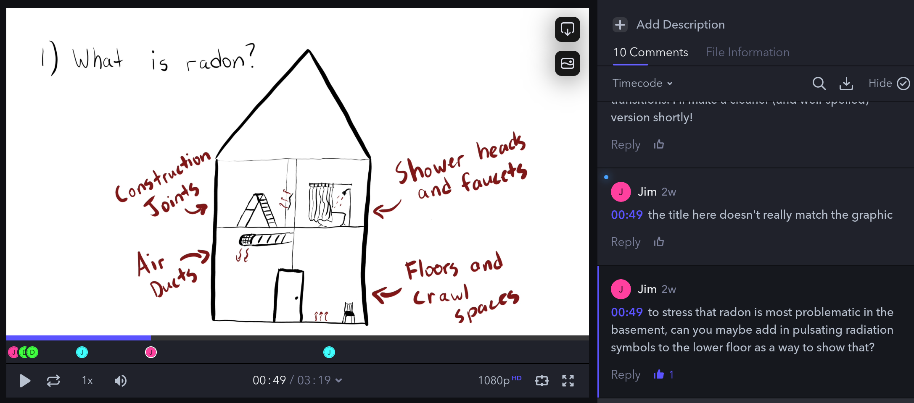

\begin{flushleft}
\textbf{Introductory Section and Methods}\\
Jacob Hall\\
Intro to Geologic Research\\
Professor Rowan Lockwood\\
\today
\end{flushleft}
\doublespacing

# Introduction

Radon gas is a common hazard in residential basements, where radon seeping out the ground can enter into houses and eventually cause lung cancer.
The William \& Mary Geology Department has been investigating the presence of radon in the Williamsburg area for decades.
Since the 80s, Rick Berquist has been conducting and encouraging research projects that build this knowledge.
These efforts have culminated in the development and validation of a radon risk map of the Williamsburg area [@miller21; @mondshine21].
Online videos are an increasingly common medium for information and entertainment consumption, and have potential for effective science communication [@finkler_leon19].
<!-- This citation mentions but does not strongly justify that statement. -->
One of the ways to make science communication engaging is to tell a story.
Storytelling allows people to connect to a concept, and informs their decisions [@joubert_etal19].
<!-- This citation is fantastic and I should look more into its references -->
There is a general lack of understanding in the United States of radon and the health risks it poses [@vogeltanz-holm_schwartz18].
For this project, I am producing a video that tells the story of radon to residents in the Williamsburg area.
To be published online alongside the risk map, my video will communicate the significance of radon, and help its audience navigate resources available for testing and mitigation.

# Research Goal  

The purpose of this video will be to communicate how radon is a potential health hazard to residents in the Williamsburg area.
To do so, it will establish what radon is and how it is naturally formed, as well as how it is a health risk.
The video will then summarize previous research on Radon in the Williamsburg area, including student research projects at William \& Mary.
The video will conclude with a call to action for viewers to learn more about radon, get their homes tested, and potentially mitigate their homes for radon.
To do all of this effectively, a thorough review will be conducted of the previous research done concerning radon in the Williamsburg area, and how it fits into the broader landscape of radon literature.
This review will include radioactive decay processes, the stratigraphy of Williamsburg, and the methods of previous researchers.
I will also research best practices in video communication of science, as well as what accessibility guidelines should be followed.
This will inform the scriptwriting process, and create objectives to be met by the final video.
The video will be an approachable introduction to why radon is an important topic for everyone in Williamsburg to be aware of.

# Geologic Background

## Introduction to Radon

Radon is a chemical element with the atomic number 86.
It occurs naturally as a short intermediate step in uranium decay chains (Figure 1).
It has three isotopes: ^219^Rn, ^220^Rn, and ^222^Rn [@weigel78].
^222^Rn is the most impactful on humans, and the isotope of radon I'll be referring to for the remainder of this project.
^222^Rn has a half-life of 3.82 days, meaning that after that amount of time half of a given quantity of ^222^Rn will have decayed into the next decay product.
The products directly following ^222^Rn are solids, and also short-lived.
Two of them, ^218^Po and ^214^Po, emit alpha particles when they decay.
When ^222^Rn is inhaled into the lungs, this process can take place within the lungs.
Alpha particles can damage the cells lining airways within the lungs, eventually leading to cancer.
This is how exposure to radon increases one's risk of lung cancer [@nationalresearchcounciluscommitteeonthebiologicaleffectsofionizingradiations88].
Radon exposure is the second-highest cause of lung cancer in the United States, behind smoking tobacco.
<!-- CITATION NEEDED -->

![Decay chain of uranium [@user:tosaka14]](./Figures/Radioactive-decay-chains-of-uranium.svg.png){height=60%}

![Yearly radon-related deaths compared to other common causes in the US [@usepa14a]](./Figures/new-EPA-radon-graph.png){width=60%}

<!--
>> Cooper's paper had the following quote and citation:
>> "Naturally occuring uranium exists in many soil and rock types...one place [it] can become concentrated is in decayed organic material...(2)"
[@swanson61]
>> I should add this to my paper

	+ "Yorktown formation is characterized by a high fossil content" [@cooper89]

-->

Concentrations of radon are commonly measured in becquerels per kilogram (Bq/Kg), or picocuries per liter (pCi/L).
Becquerels and curies are both measurements of radioactivity, i.e. they represent the frequency of radioactive decays.
<!-- I prefer becquerels! IDK WHICH ONE TO USE -->

## Previous Work in Williamsburg Area

The Environmental Protection Agency's published radon risk map shows Virginia's coastal plain as the lowest-risk region in the state, labeled as "Low Potential (less than 2pCi/L)" [@Virginia].
The Virginia Department of Health has published the same map on their website [@Indoor].
Someone living in the Williamsburg area who reads this map would likely conclude that their home is at negligible risk of radon exposure.
While this might be true for much of the coastal plain, research has shown there are areas of higher risk that would be colored in red on the aforementioned map.

In 1978, Khandelwal and Singh published a short article in Health Physics sharing that they had discovered radioactivity in whale bone vertebra in the Chesapeake Bay area, including in the Yorktown Formation.
<!-- This feels a little out-of-place. Maybe I could find another source about radioactivity in the Chesapeake? -->
<!-- ALSO, please note @khandelwal_singh78 is added as a nocite so that the paragraph formatting can be as such -->
Research on radon at William \& Mary started around 1989 when Jennifer M. Cooper wrote a report about the Yorktown Formation as a potential source of radon in the Williamsburg area [@cooper89].
<!-- She discovered a house had 30pCi/L, and even more underneath! -->
She tested a number of different locations in York River State Park, correlating the Yorktown formation with radon emission using her own data.
<!--
"In order for radon gas to be emitted from the ground, a fairly high level of soil permeability must exist (1)"
Lasch, David K, 1988, "On Radon": Virginia Minerals, vol.34, no.1 published by Division of Mineral Resources.
-->

The second student at William \& Mary to investigate radon was Tracy Whitesell.
Her project involved testing different locations for radon, and she compared different formations by makeup and average radon concentration.
Her results clearly show that the Yorktown has higher radon concentrations than nearby formations.
Whitesell was one of the first to so thoroughly illustrate the radon landscape in the Williamsburg area, and her work was remarkable in confirming the suspicions of previous researchers.
In the final sentence of her thesis, she recommended that "houses built within or on the Yorktown should be tested for radon" [@whitesell90].

<!--
Borne (94?) -- summarized earlier work, compared Yorktown Formation to different formation -->

In 2020, Dorian Miller created [a "risk map" of radon near William \& Mary's campus](https://arcg.is/zHjSG).
This map was created by mapping elevation data at certain thresholds, because the Yorktown Formation is a horizontal layer that becomes closer to the surface as the elevation decreases [@miller21].

![Radon risk assessment map of Williamsburg [@miller_etal20]](./Figures/radon-risk-map.png)

In 2021, Zoey Mondshine validated the risk map, by testing individual homes and comparing their relative test results to the regions on the risk map.
Among other observations, she identified a home in the "Low Radon Risk" region with radon levels above the EPA's recommended limit of 4pCi/L [@mondshine21].

# Methods

## Scriptwriting

With the broader goals of this project defined, writing the script brought a clearer structure to the production of this video.
The content needed to not only convey important points about radon, but also have a short narrative arc.
After workshopping the structure with Professor Ibes, we landed on the following sections:

1. Lede
1. Health Concern
1. Background & Research
1. Who Needs to Know
1. What Can You Do
1. Kicker.

In our meetings, my advisors and I decided that the video should remain relatively short, in order to maintain our audience's attention and focus on the most important points.
For each of the sections, I slowly developed the content for each while working with Professor Ibes to boil the content down to have concise wording.
I also met periodically with Heather, Rick and Jim to review the script with regard to the overall goals of the project, and scientific accuracy of the content.
Rick helped me narrow the scope of my video to the geologic concepts most relevant to this area, and showed me radon concentration data collected in Williamsburg homes.
By the end of the summer, the script had reached a final draft, and I could record the first draft of the voiceover.

## Beginning to Draw Graphics

Using a drawing tablet borrowed from Reeder Media Center, I began drawing the concepts touched on in the script using a program called Krita.
As I developed them, I emailed versions to my advisors, and met with Professor Ibes to brainstorm how to convey they most important concepts.
It became critical to link each graphic with a section of the script, in order to hone each to complement the other.
I annotated the script with markers denoting which graphic would be shown where, and what would be visually described with the audio.

## Video Production

By mid-October, I had begun to connect a series of graphics with the content of the script.
Consulting with Drea George, a multimedia specialist at Reeder Media Center, I learned how to assemble my graphics onto a timeline in Adobe After Effects.
Using keyframe and masking techniques, I could animate each graphic, having it appear at the times I need and controlling how it would layer with other assets.
Drea also showed me an animation technique called boiling, which involves multiple similar frames of the same drawing played in a loop, which brings the drawing to life and gives it more character than a static shape.

## Iteration

One of the most important processes I had to see through as production continued, was the iterative gathering of feedback.
There were few times when each piece of the project were developed to the same degree: sometimes the voiceover outdated the script, or a section of the video had been edited more thoroughly than another.
As I improved upon each asset, and better placed it on the video editing timeline, I periodically exported the video as a draft, and uploaded it to a video collaboration and editing platform called Frame.io.
Using an online interface, my advisors could then view each of my drafts, and comment at any timecode with advice on how to improve it.

With each round of feedback, I was able to prioritize aspects of the video that did not yet realize our shared vision, and communicate my progress clearly to my advisors.

 
# References

